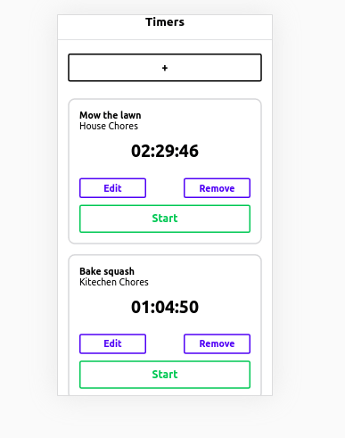

# ⏰ Time Tracking App

> A simple and efficient time tracking application built with React Native and Expo.

## 📝 Description

This app allows users to **add**, **delete**, and **modify** timers for various tasks they want to keep track of.
Each timer corresponds to a different activity — perfect for tracking productivity and managing work hours.

## 🖼️ Screenshot

<p align="center">
  
</p>

## 🚀 Run as a Web Application

Follow the steps below to run the app locally:

1. Clone the repository

   ```bash
   git clone https://github.com/SevenSquare-Tech/time-tracking-app
   ```

2. Navigate to the project directory

   ```bash
   cd time-tracking-app
   ```

3. Install dependencies

   ```bash
   yarn
   ```

4. Run the app in your browser
   ```bash
   yarn web
   ```

## 🧩 Features

- Add, edit, and delete timers easily
- View total time tracked for each task
- Responsive web interface
- Built using **React Native**, **Expo**, and **Yarn**

## 👨‍💻 Author

Developed by **SevenSquare Tech**
